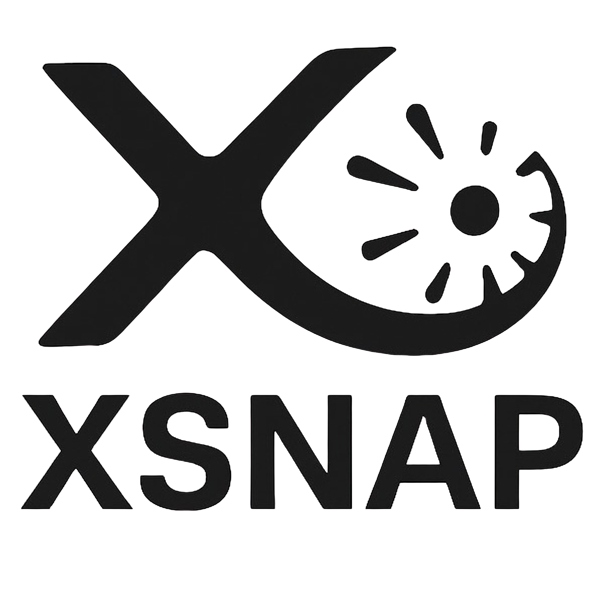

.. _intro:

###############
What is XSNAP?
###############

Introduction
============

XSNAP (X-ray Supernova Analysis Pipeline) is a Python-based pipeline module that automates every step of
X-ray supernova data reduction and analysis, from raw event processing and region selection to spectral fitting. 
XSNAP provides dedicated standard data calibration and spectral extraction scripts for Chandra X-ray Observatory 
(CXO), Swift-XRT, XMM-Newton, and NuSTAR data.

XSNAP, with the help of PyXspec, is able to model and fit spectra using a wide range of astrophysical models 
(e.g., Thermal-Bremsstrahlung and Powerlaw). Additionally, XSNAP can generate photometric data through the fitted spectra. 

A follow-up analysis using the Thermal-Bremsstrahlung model can be made, specifically for Type II Supernova. 
From luminosity fitting to estimating Circumstellar Medium (CSM) densities and mass-loss rates of the supernova progenitors, 
XSNAP streamines the workflow so you can spend less time on rewriting each analysis manually.

More analysis functions can be made upon requests (view `Development <development>`_ for more details)

Components
============

XSNAP is organized into two main parts: 

- command-line scripts (where users can invoke on the shell or jupyter notebook), and
- built-in module or Python API (where you can import functions and classes).

There are six scripts available for users to run:

.. list-table::
   :widths: 20 80
   :header-rows: 1

   * - **Script**
     - **Description**
   * - ``extract-chandra``
     - Calibrate & extract spectrum from Chandra observations.
   * - ``extract-swift``
     - Calibrate & extract spectrum from Swift-XRT (PC/WT mode available).
   * - ``swift-stack-pc``
     - Bin & stack Swift-XRT PC-mode data (default 1-day bins).
   * - ``extract-xmm``
     - Calibrate & extract spectrum from XMM-Newton.
   * - ``extract-nustar``
     - Calibrate & extract spectrum from NuSTAR.
   * - ``make-region``
     - Generate ICRS source/background region files.  
       (Physical region files will also be made if you have DS9)

And there are five Python classes to call:

.. list-table::
   :widths: 20 80
   :header-rows: 1

   * - **Class**
     - **Description**
   * - :py:class:`~xsnap.SpectrumFit`
     - Model a spectrum and estimate best-fit parameters.
   * - :py:class:`~xsnap.SpectrumManager`
     - Handling and compiling a collection of :py:class:`~xsnap.SpectrumFit`, streamlining bulk analysis of spectra.
   * - :py:class:`~xsnap.SourceDetection`
     - Bin & stack Swift-XRT PC-mode data (default 1-day bins).
   * - :py:class:`~xsnap.CSMAnalysis`
     - Analyze the circumstellar medium of the supernova.
   * - :py:class:`~xsnap.TemperatureEstimator`
     - Estimate temperature at a certain time with power-law, given a set of data or best-fit parameters